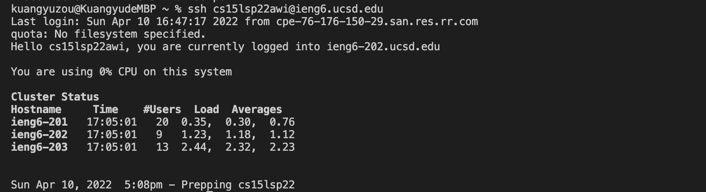

# Installing VScode

This is the first step of opening the VS code after installing successfully. 

# Remotely Connecting

This is the second step of remmote connecting to connect your own machine to the remote computer.

# Trying Some Commands

This is some command running in the terminal. "cd" means to find the folder under the main computer(directory), and "cd ~" will let you back to the main directory. The "ls" will display all of the created folder or file in your main computer. The "mkdir" will let you create a new folder or file. 

# Moving Files with scp

This is the practice of using the "scp" to copy the file to a remote computer.

# Setting an SSH Key

This is the step to create a ssh-keygen pair in the computer. 

After creating the ssh-keygen pair, we don't need to login with the password. 

# Optimizing Remote Running

This is the step that can run the file in remote server. 