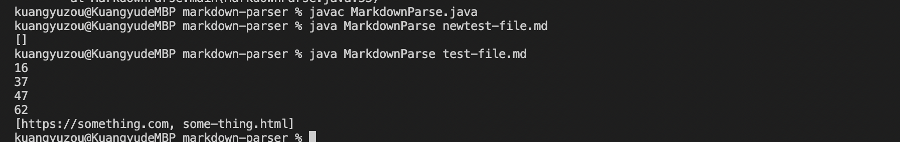

# First Code Change

[newtest-file](https://kuangyuzou.github.io/markdown-parser/newtest-file.html)

After fix the code, the picture below shows that the code pass the test and also the origial testfile can also be passed.

# Second Code Change

[test2-file](https://kuangyuzou.github.io/markdown-parser/test2-file.html)

After fix the code, the picture below shows that the code pass the test and also the origial two testfiles also passed.

# Third Code Change

[test3-file](https://kuangyuzou.github.io/markdown-parser/test3-file.html)

After fix the code, the picture below shows that the code has a correct output which will not return the string in the parentheses sice this is the image refrence.

The first code results in an infinite loop because the code ends with the blank line. When we delete the blank line, then the loop will run successfully. 

The second code results in only the last link content be returned. The reason is that this code ends with the valid link, the first link in newtest-file.md is not a valid link, so the results will not include the content in the first brackets. 

The third code results in an infinite loop because the code ends with the invalid link which is the bracktes. The valid link is in the middle so our code will run into an infinite loop that have no result. 