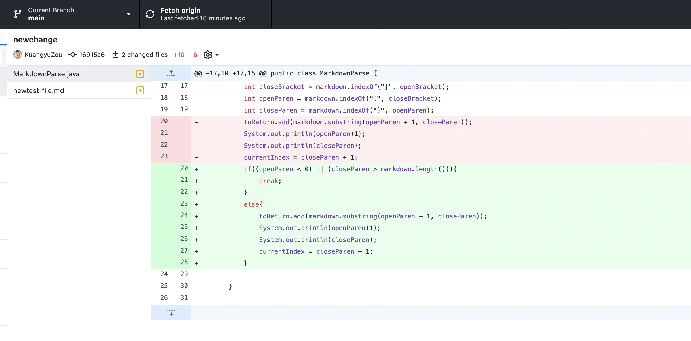
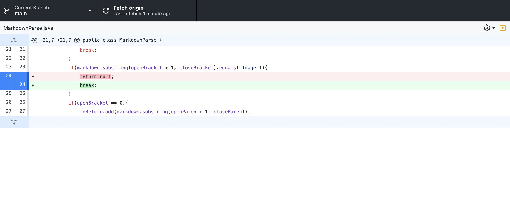

# First Code Change

[newtest-file](https://kuangyuzou.github.io/markdown-parser/newtest-file.html)

After fix the code, the picture below shows that the code pass the test and also the origial testfile can also be passed.

# Second Code Change

[test2-file](https://kuangyuzou.github.io/markdown-parser/test2-file.html)

After fix the code, the picture below shows that the code pass the test and also the origial two testfiles also passed.

# Third Code Change

[test3-file](https://kuangyuzou.github.io/markdown-parser/test3-file.html)

After fix the code, the picture below shows that the code has a correct output which will not return the string in the parentheses sice this is the image refrence.

The first code results in an index out of bound problem because there is no link in the newtest file, so the code does not find the opened parenthese and the closed parenthese. Therefore, there is no substring between the parentheses since no parentheses found. So the code will have index out of bound problem when call the method "markdown.substring(Openparen+1, closeParen)", the screenshot of output indicates "it begins at 0, but ends with -1". So if we want to fix the bug, we just need to add a condition at the front when the index of OpenParen is 0, then the code should break and return an empty list. 

The second code results in an infinite loop because the link is at the start of the test2 file, so the currentindex will always less than the markdown length. Therefore, in the while condition statement, since the currentIndex will always less than the markdown length, the while loop will infite. If we want to fix the bug, we just need to add another condition at the front which is when the Openbracket index is 0, then the code should directly return the string in the link, instead of increase the currentIndex value.

The third code results in a wrong output since this is actually an image refrence not the link. So we need to change code to verify whether the refrence is a link or an Image. So we need to add another condition at front which is when the string in the bracket is "Image", then the code should verify that this is not a link and should break and return an empty list. 