# Streamlining ssh Configuration

these pictures below shows the .ssh/config file and using ssh ieng6 to log in to remote server account.
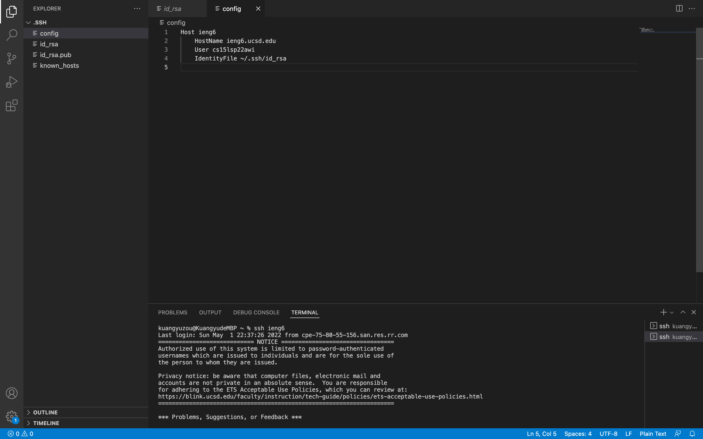

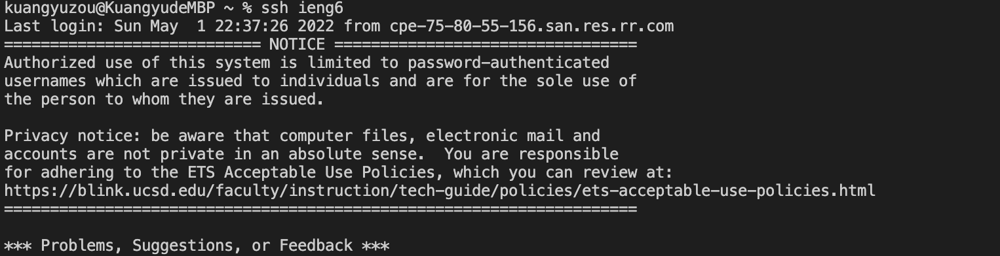

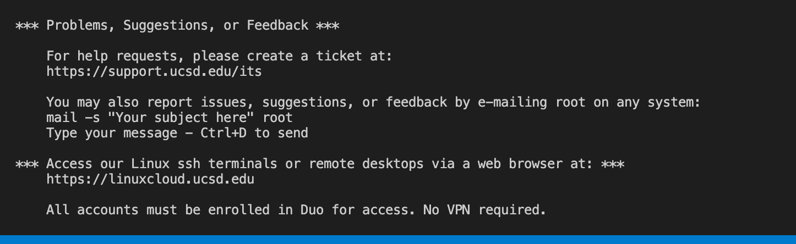

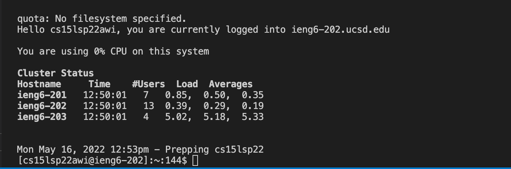

These two pictures below shows using scp to copy file into remote server and log in with ssh ieng6 again.
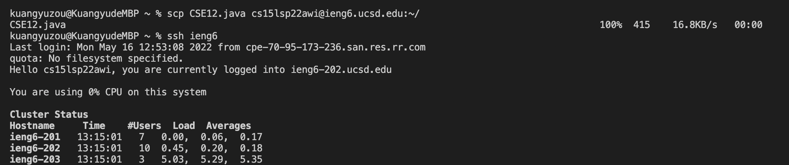
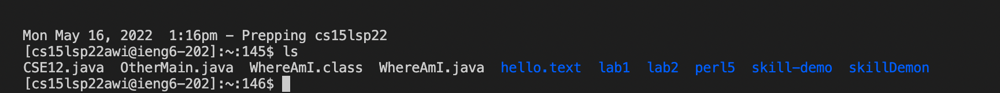

# Setup Github Access from ieng6
These pictures below shows the public ssh key in Github and in the user account and the private ssh key in user account.
I create a new ssh-keygen pair in remote server account. Then I copy the public ssh key to my Github account so that I can using git command on my remote server.
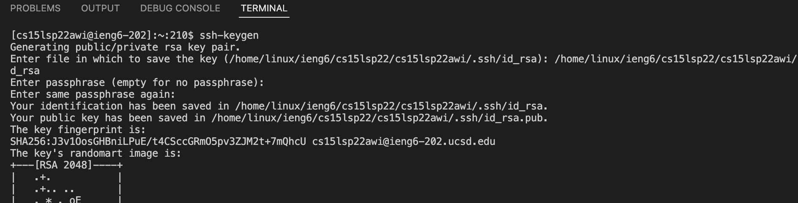
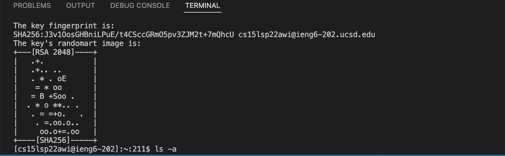
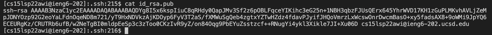
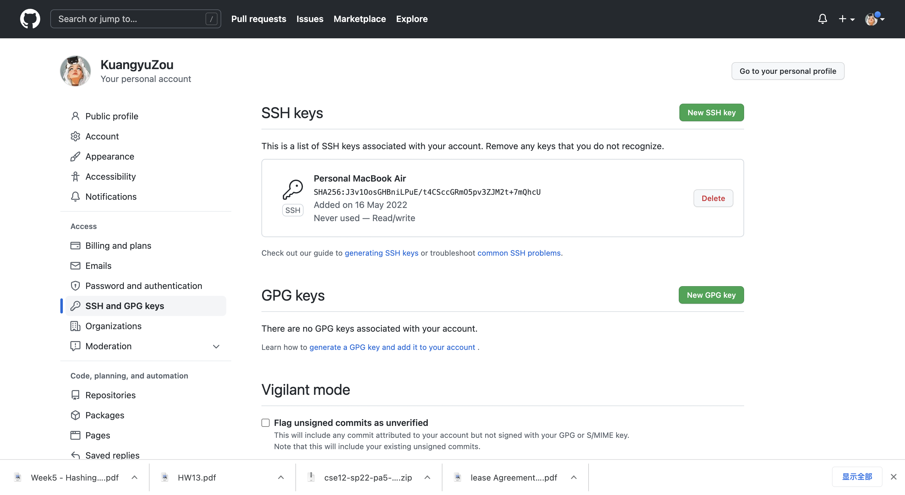
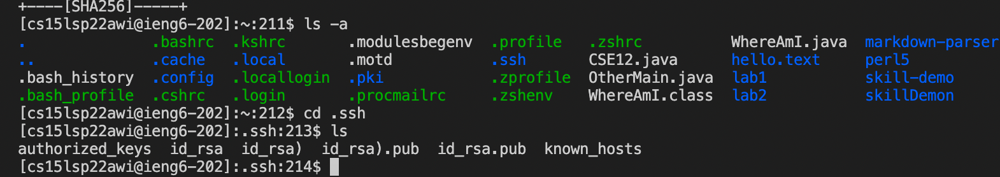

This picture below shows that I successfully access my repository of github and using git command on remote server to push and update the markdownParse java file.
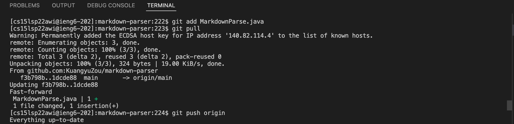

In the main method of MarkdownParse.java file, I add a new line to print out the "good day" in the end.

[Resulting Commit](https://github.com/KuangyuZou/markdown-parser/blob/main/MarkdownParse.java)

# Copy whole directories with scp -r
These pirctures below shows the copy whole repository to remote server and running test of the repository on remote server and also combine ssh and scp to copy the test file and run test.
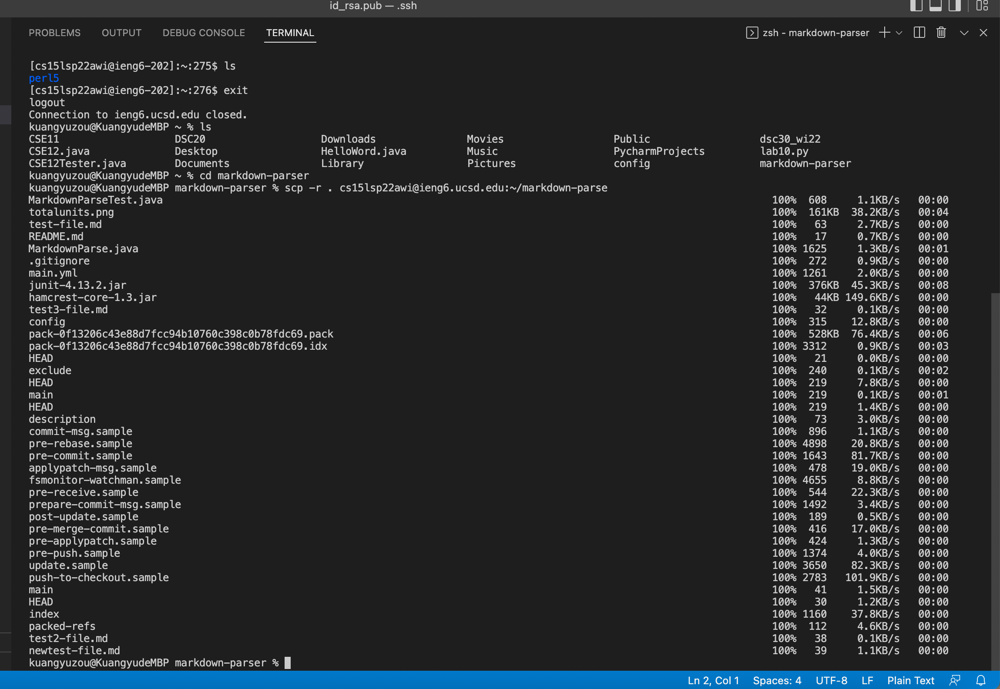
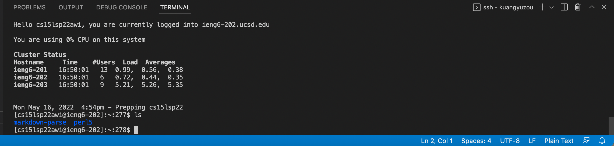
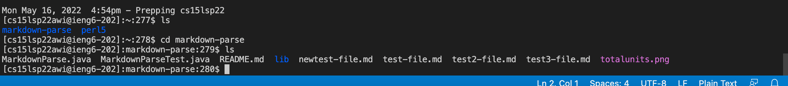
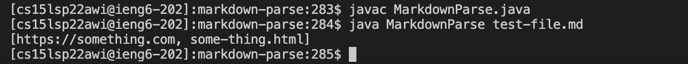
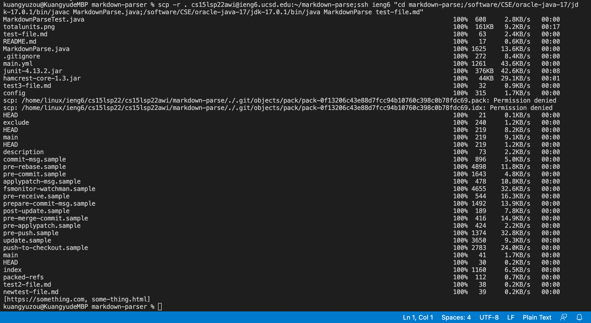

