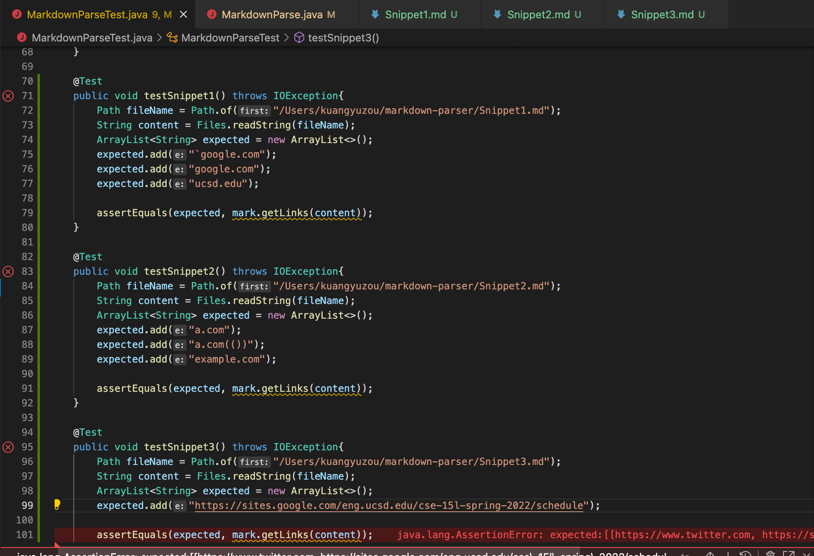
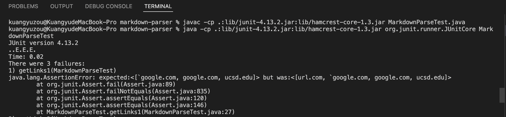
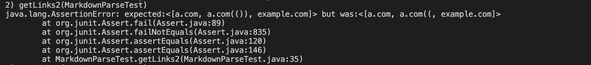

# Link of own and reviewded Reposiotory
[Own Reposiotory](https://github.com/KuangyuZou/markdown-parser)

[Reviewed Reposiotory](https://github.com/MichaelYe48/markdown-parser)

# For Each Test Task
## 1.Using VSCode Preview,

the Snippet1 should has the result as [`google.com,google.com, ucsd.edu]

the Snippet2 should has the result as [a.com,a.com(()), example.com]

the Snippet3 should has the result as [https://sites.google.com/eng.ucsd.edu/cse-15l-spring-2022/schedule]

## 2.Showing the Test Code

The screenshot below shows the test for Snippet1,2,3 in my own MarkdownTest.java

The screenshot below shows the test for Snippet1,2,3 in the reviewed MarkdownTest.java.

## 3.Test Output for my own repository and Explaning
1).The screenshot below shows the test outputs of Snippet1.md by my own implemention of MarkdownParse.java.

From the result, the test for Snippet1 is failed. The actual result includes the "url.com" in the list besides other links. However, from the preview, we know that the "url.com" is an invalid link since the beginning of the this link is violated the correct link format in Markdown documents. This link begins with backtick instead of the bracket. My code does not verify that this link is an invalid link so it returns this link as well. I think the code change will less than 10 lines since we can just add an extra if statement to verify whether the beginning of the link format is correct so that the code can pass this test. 

2). The screenshot below shows the test outputs of Snippet2.md by my own implemention of MarkdownParse.java.

From the result, the test for Snippet2 is also failed. The actual result has the wrong output for the 
"a.com(())" link, which returns the "a.com((" instead. The reason for this wrong output is because my code will automatically return the substring between the openParen and the first finded closedParen. Therefore the code think that the "a.com((" is correct since after "(" is the first closed finded ")". I think for the nested parentheses, my code change will less than 10 lines since it just needs to add additional if statement to verify whether after first closed bracket, the string has the next open bracket. If the string has next open bracket, then just return the substring between openParen and the final closedParen before the next open bracket. If the string does not nas next open bracket and reaches the end, then just return the substring between the openParen and the last closedParen.

3). The screenshot below shows the test outputs of Snippet3.md by my own implemention of MarkdownParse.java.

From the result, the test for Snippet3 is also failed. The actual result runs into an infinite loop so that the terminal indicates "Out of Memory Error". The reason is that since after the last closeParen of the last link,  the currentIndex can not find the next openBracket, so the currentIndex will eventually become -1. In the while condition, if the currentIndex is less than the total length of the file, then the condition is true. Since -1 is less than the length of the file, so the code run into infinite loop. The code change will less than 10 lines since we just need to add additional if statement which is that if the currentIndex is equal to -1, then the code should break. 

## 4.Test Output for reviewed repository and Explaning
1).The screenshot below shows the test outputs of Snippet1.md by reviewed implemention of MarkdownParse.java.

The test is failed. The actual result returns the "url.com" besides other three valid links. However, from the preview, we know that the "url.com" is not a valid link since it begins with "`" instead of "[". The code change will less than 10 since we just need to add a if statement to verify whether the beggining of the link is in correct format which starts with "[". This also means that the first openBracket should not have anything before it. If the first openBracket has something before it, then it is not a valid link.

2). The screenshot below shows the test outputs of Snippet2.md by reviewed implemention of MarkdownParse.java.

The test is failed. The actual does not return the "a.com" and also only returns part of the second link which is "a.com((" in the result list. The reason for the code does not return the "a.com" is that it contains a if statement and states that if there is "!" before the ccurrentIndex, then the code continue and currentIndex will change. This will cause problem when comes into the first link content, the "!" will return -1 since there is no "!" in Snippet2.md, and the openBracket's index is 0, so openBracket - 1 is equal to -1 so that this if condition is true, and the currentIndex will change to next openBracket and the first link content will not be return. 
The second link is incomplete in the actual output which has the same reason with  my own code. This review code also returns the link content between the openParen and the first finded closedParen, so it only returns the "a.com((" since the code thinks that the ")" is the final closedParen, it does not look through all the ")" after "a.com((". Therefore, the code change is also less than 10 lines. It just need to delete the if statement as I mentionded above and add a new additional if condition which is to verify whether the ")" is the final closedParen. If the ")" is before the next open Bracket or the file reaches the end, then the ")" is the final closedParen, and should return the link content bewteen the openParen and final closedParen.

3).The screenshot below shows the test outputs of Snippet3.md by reviewed implemention of MarkdownParse.java.

The test is failed. Besides the correct valid link content, the actual outpur also returns the invalid link content.  The reason is that the code does not know how to verify the validity of the correct format of the link. The logic in the code just to find the open and closed brackets pair at first, then it find the afterwards openParen and closedParen paris and return the link content between them. From Snippet2.md, we know that this reviewed code will not return the first link since it has the extra if statement as stated above, it will let the code continue and update the currentIndex. Tough the first link is invalid and the code does not return, but the code still has problem for can not verify the correct format of the link in markdown file. So I think the code change is less than 10 lines, we just need to add additional if statement to tell the code that the space between two brackets should not have additional new lines and break if it has. Another if statement is that for the situation of the link does not have closedParen, this is also easy to detect for writing if after the openParen, the space between next closedParen and the openParen has the openBracket or a newline, then break, should not return. 

