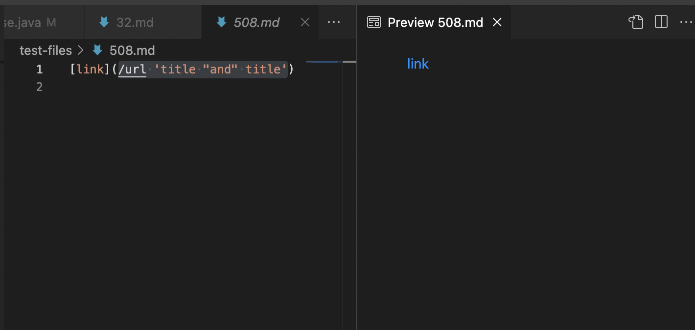
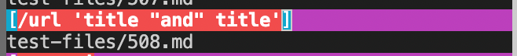
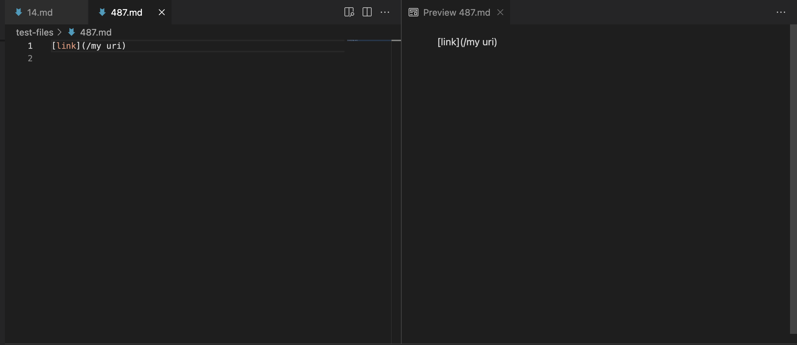
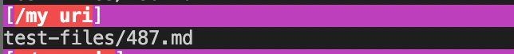
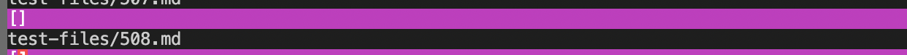
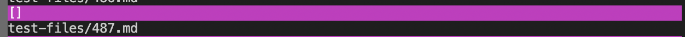
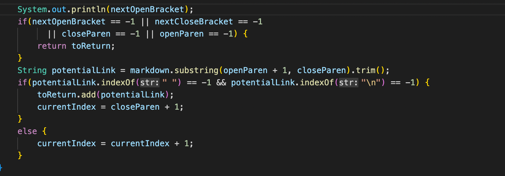
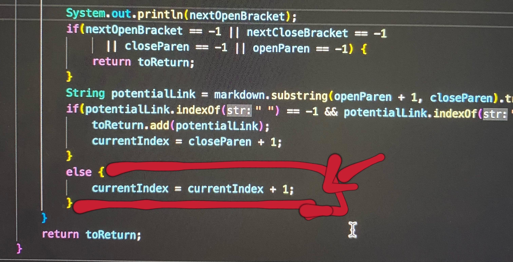
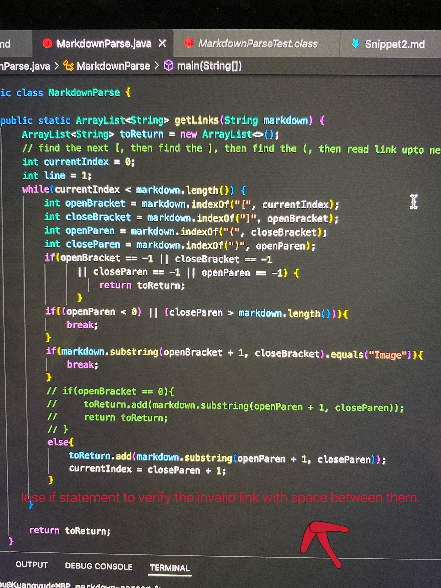

# Different Tests using Vimdiff

I use vimdiff command and the output redirection to see the difference tests result between my repository and the given repository. 

# Test-file Link
[test-files](https://github.com/nidhidhamnani/markdown-parser/tree/main/test-files)

# Chosen  Two Tests out of 652 overall tests.
For the two tests, I choose the 508.md file and the 487.md file. 

# Each Test Explaination
## 1. My Own Repository test result.
1) For the 508.md file test, my implementation is correct. Since from the preview in VSCode,

we know that this link is valid and the expected output should be[/url 'title "and" title']. My actual output is the below picture from vimdiff results.txt:

2. For the 487.md file test, my implementation is incorrect. Since from the preview in VSCode,

We know that this linke is not valid, so the expected output should be [ ].
My actual is the below picture showing:

## 2. The Given Repository test result.
1. For the 508.md file test, the given implementation is incorrect. Since from the preview in VSCode as indicated above, the expected output should be[/url 'title "and" title']. However, the actual output is below screenshot showing:

2. For the 487.md file test, the given implementation is correct. Since from the preview in VSCode as indicated above, the expected output should be[ ].
The actual output from the given repository is the below screenshot showing:

# Wrong Output Explaination
1. For the 508.md test file, my implemention is correct but the given implemention is wrong. The given implemention returns nothing which is an empty list. The reason is that, from the code below:

if any nextOpenBracket or nextCloseBracket or closeParen or openParen equals to -1, the code just return the list immediately.Using System.out.println, it shows that the nextOpenBracket will become -1 after the loop because of the currentIndex will increased by 1 in the next else-if statement. So finally the code just return an empty list. I think that the code need to be fixed is the currentIndex should be updated by closeParen+1, not the currentIndex+1. The content under else statement need to be changed. 

2. For the 487.md test file, my implemention is incorrect. The reason is that, my code lose an additional if statement to verify whether the link content with space between them is a valid link or not. Actually, from the preview in VSCode, we know that if the link has space between characters in them, it is not a valid link. So the code change is to add an additional statement to verify that if there is any space in the link, then should return nothing and continue to check next link or return an empty list if this link is th only one link in the md file. 
Here below is my code image:
