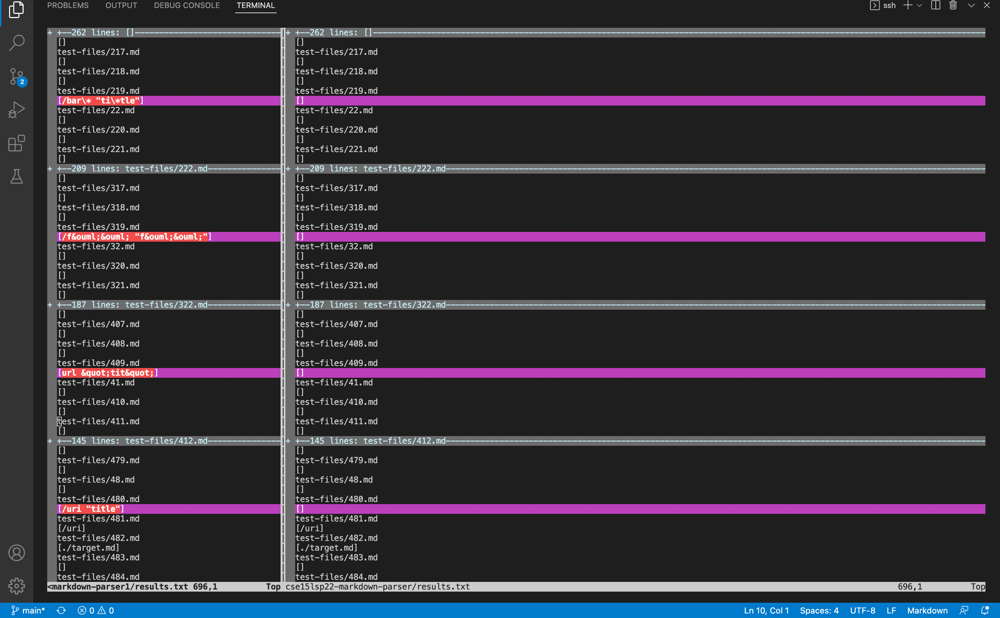
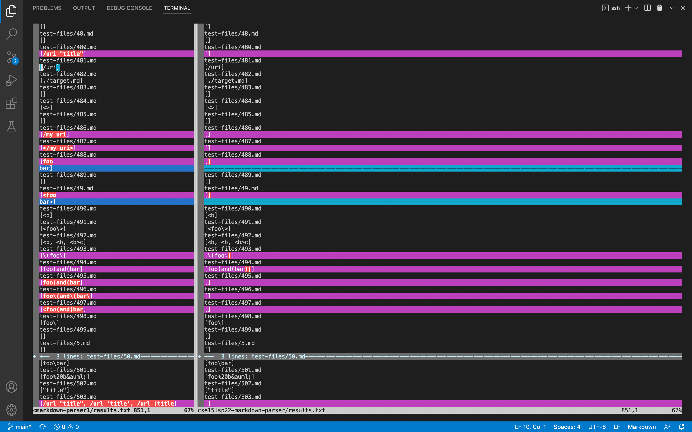
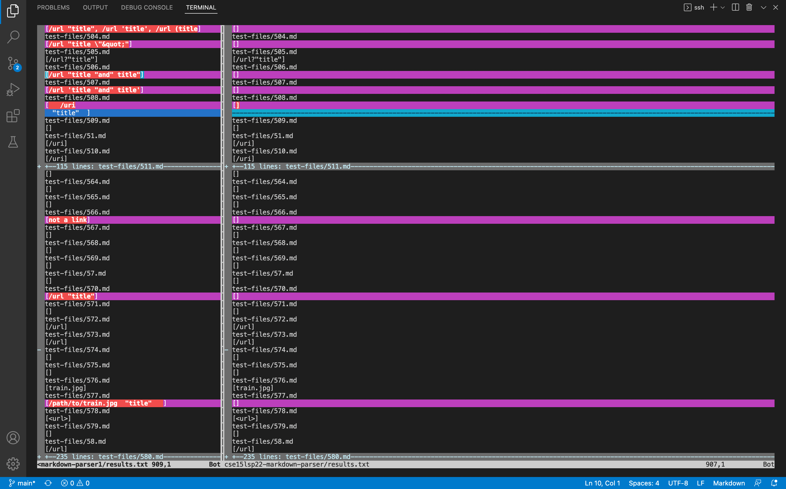

# Different Tests using Vimdiff

I use vimdiff command and the output redirection to see the difference tests result between my repository and the given repository. 

# Test-file Link
[test-files](https://github.com/nidhidhamnani/markdown-parser/tree/main/test-files)

# Chosen  Two Tests out of 652 overall tests.
For the two tests, I choose the 32.md file and the 487.md file. 
